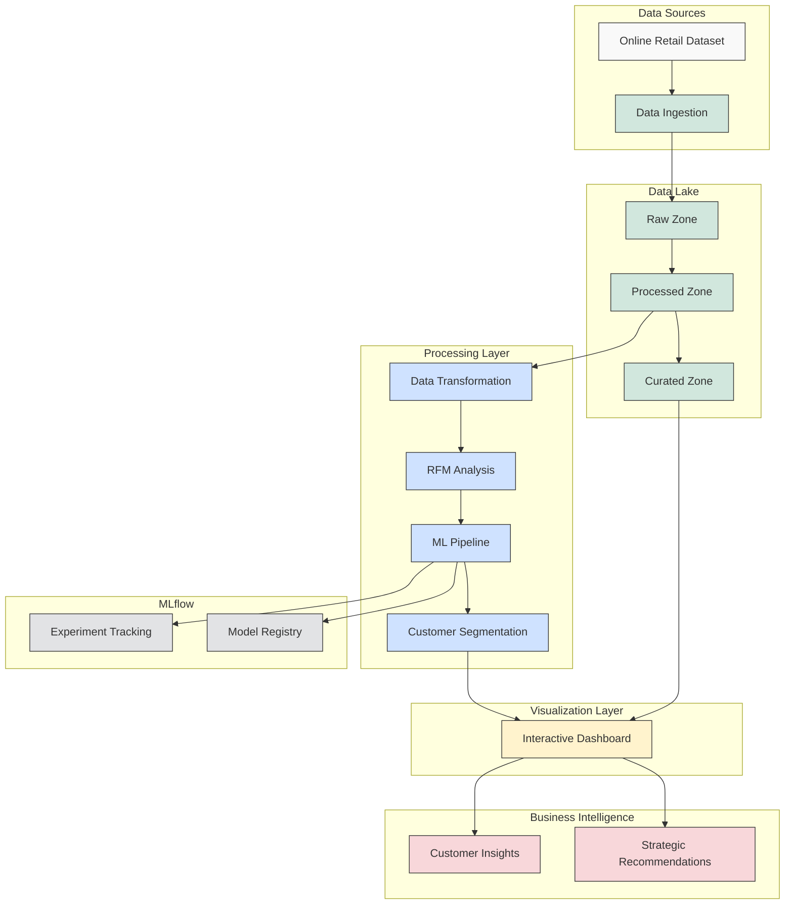

```mermaid
graph TD
    subgraph "Data Sources"
        A[Online Retail Dataset] --> B[Data Ingestion]
    end
    
    subgraph "Data Lake"
        B --> C[Raw Zone]
        C --> D[Processed Zone]
        D --> E[Curated Zone]
    end
    
    subgraph "Processing Layer"
        D --> F[Data Transformation]
        F --> G[RFM Analysis]
        G --> H[ML Pipeline]
        H --> I[Customer Segmentation]
    end
    
    subgraph "MLflow"
        H --> J[Experiment Tracking]
        H --> K[Model Registry]
    end
    
    subgraph "Visualization Layer"
        I --> L[Interactive Dashboard]
        E --> L
    end
    
    subgraph "Business Intelligence"
        L --> M[Customer Insights]
        L --> N[Strategic Recommendations]
    end
    
    style A fill:#f9f9f9,stroke:#333,stroke-width:1px
    style B fill:#d1e7dd,stroke:#333,stroke-width:1px
    style C fill:#d1e7dd,stroke:#333,stroke-width:1px
    style D fill:#d1e7dd,stroke:#333,stroke-width:1px
    style E fill:#d1e7dd,stroke:#333,stroke-width:1px
    style F fill:#cfe2ff,stroke:#333,stroke-width:1px
    style G fill:#cfe2ff,stroke:#333,stroke-width:1px
    style H fill:#cfe2ff,stroke:#333,stroke-width:1px
    style I fill:#cfe2ff,stroke:#333,stroke-width:1px
    style J fill:#e2e3e5,stroke:#333,stroke-width:1px
    style K fill:#e2e3e5,stroke:#333,stroke-width:1px
    style L fill:#fff3cd,stroke:#333,stroke-width:1px
    style M fill:#f8d7da,stroke:#333,stroke-width:1px
    style N fill:#f8d7da,stroke:#333,stroke-width:1px
```
